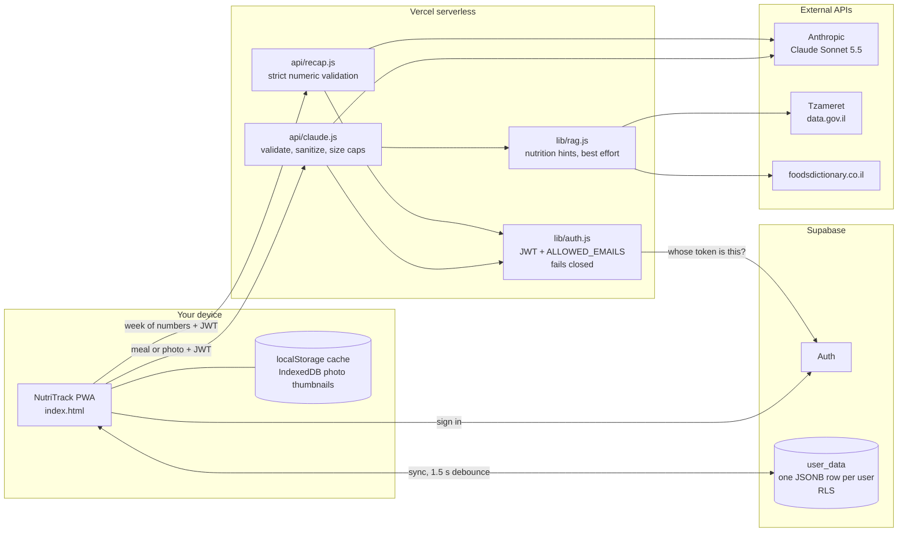

# NutriTrack

> AI-powered nutrition tracking — chat to log, sync everywhere.

A personal nutrition tracker built as a no-build-step PWA. Describe what you ate in plain Hebrew or English, and Claude AI parses it into calories and protein. Data syncs across all your devices via Supabase and installs on your iPhone home screen.

---

## Features

- 💬 **Chat-based meal logging** — describe food naturally in Hebrew or English; Claude AI extracts calories & protein
- 📊 **Real-time calorie & protein tracking** with goal ranges (min/max)
- ⚡ **Daily deficit calculation** vs your TDEE
- ⚖️ **Weight progress log** with SVG trend chart
- 💡 **Weekly insights & personalized tips** from Claude
- 🔄 **Cross-device sync** (iPhone ↔ PC) via Supabase PostgreSQL
- 📱 **PWA** — installable on iPhone home screen (no App Store needed)
- 👤 **Multi-user** with per-user isolated data (Row Level Security)
- 🔁 **Reset Day** — undo today's logs and start fresh
- 🥑 **Carbs & fats** per meal, with Israeli nutrition-database hints (Tzameret, foodsdictionary) to ground Claude's estimates
- 📷 **Meal photos** — snap a meal and Claude estimates it (thumbnails stay on your device)
- ⭐ **Saved meals** — favourites you can re-log in one tap
- 🧠 **Weekly recap** on demand, a live protein nudge and a smoothed weight trend
- 📤 **Export** your data as JSON or CSV

---

## Tech Stack

| Layer | Technology |
|-------|-----------|
| Frontend | React 18 (CDN), Babel Standalone, JSX in browser |
| Styling | Inline React styles, warm-ink dark theme (`#14110F`), Fraunces + Manrope type |
| Auth | Supabase Auth (email/password) |
| Database | Supabase PostgreSQL, JSONB blob per user, RLS |
| AI | Anthropic Claude Sonnet 5.5 (via Vercel serverless function) |
| Hosting | Vercel (static site + serverless API) |
| Sync | `localStorage` cache + debounced Supabase upsert (1.5 s) |
| PWA | Apple Web App meta tags, `viewport-fit=cover` |

---

## How it works

The browser talks to Supabase directly for sign-in and sync, and to two small Vercel functions for anything that needs the Anthropic key. The key never reaches the browser.



**The path of one meal**

1. You type "2 eggs and a pita" (or snap a photo) in the chat.
2. The browser sends the chat plus your Supabase JWT to `/api/claude`.
3. `lib/auth.js` asks Supabase who the token belongs to, then checks the email against `ALLOWED_EMAILS`. With no allowlist configured, everyone is rejected.
4. The payload is validated (message count, text length, one image max) and your profile numbers are clamped before they are put into the system prompt.
5. `lib/rag.js` looks the food up in the Israeli Ministry of Health table (Tzameret) and foodsdictionary as hints. It is best effort and never blocks the request.
6. Claude answers with structured JSON `{items, total_calories, total_protein, message}`. The server extracts the final JSON object and returns it.
7. The app updates state, writes the `localStorage` cache and, after a 1.5 s debounce, upserts your row in Supabase. On the next load the Supabase copy wins and `localStorage` is the fallback.

**Serverless functions**

| Function | Job |
|----------|-----|
| `api/claude.js` | Auth, validation, RAG hints, then Claude parses a meal (text or photo) into calories, protein, carbs and fats |
| `api/recap.js` | Auth, strict numeric validation, then a short weekly recap written from numbers only |

**Notable design decisions**

- **The server owns the prompt.** The browser sends meals and numbers, never prose that becomes instructions, so the system prompt cannot be rewritten from the client.
- **Fails closed.** A missing or empty `ALLOWED_EMAILS` blocks everyone instead of opening the API to every signed-in user.
- **Photos stay on the device.** The image is sent to Claude for the estimate. Only a small thumbnail is kept, in the browser's IndexedDB, and it is never written to Supabase.
- **One row per user.** The whole app state is a single JSONB blob protected by Row Level Security, so there are no migrations to run beyond the SQL below.
- **No Supabase Edge Functions.** All server logic is in the two Vercel functions above.

---

## Project Structure

```
NutriTrack-Public/
├── index.html              # Entire frontend — React app, all components, all styles
├── Logo_NoBackground.png   # Logo used by the app
├── api/
│   ├── claude.js           # Serverless function — JWT auth + allowlist + Claude meal parsing
│   └── recap.js            # Serverless function — weekly recap
├── lib/                    # Shared server helpers
│   ├── auth.js             # Supabase JWT + ALLOWED_EMAILS check (fails closed)
│   ├── validate-messages.js# Chat/vision payload validation + size caps
│   ├── sanitize-settings.js# Clamps profile numbers before they reach the prompt
│   ├── rag.js              # Nutrition-database lookups (Tzameret, foodsdictionary)
│   ├── model-text.js       # Reads Claude's answer past empty thinking blocks
│   ├── insights.js         # Protein nudge + smoothed weight trend (pure display helpers)
│   └── export.js           # JSON / CSV export
├── tests/                  # node:test unit tests (*.test.mjs) + Playwright specs (*.spec.js)
├── docs/media/             # README product tour
├── vercel.json             # Function config (maxDuration: 30s) + security headers
├── package.json            # Minimal — Node ≥ 18 engine declaration
└── LICENSE
```

---

## Getting Started (local dev)

### Prerequisites

- [Node.js 18+](https://nodejs.org/)
- [Vercel CLI](https://vercel.com/docs/cli): `npm i -g vercel`
- A [Supabase](https://supabase.com/) project (free tier works)
- An [Anthropic API key](https://console.anthropic.com/)

### 1. Clone & install

```bash
git clone https://github.com/Adivar5/NutriTrack-Public.git
cd NutriTrack-Public
```

No `npm install` needed to run the app — there are no runtime dependencies. The frontend loads everything from CDN (version-pinned, with Subresource Integrity hashes).

### 2. Set up Supabase

Run the following SQL in your Supabase SQL editor:

```sql
-- Create the user_data table
CREATE TABLE user_data (
  id          UUID PRIMARY KEY DEFAULT gen_random_uuid(),
  user_id     UUID NOT NULL REFERENCES auth.users(id) ON DELETE CASCADE,
  data        JSONB NOT NULL DEFAULT '{}',
  updated_at  TIMESTAMPTZ NOT NULL DEFAULT now(),
  UNIQUE (user_id)
);

-- Row Level Security — each user can only access their own row
ALTER TABLE user_data ENABLE ROW LEVEL SECURITY;

CREATE POLICY "Users can read own data"
  ON user_data FOR SELECT
  USING (auth.uid() = user_id);

CREATE POLICY "Users can upsert own data"
  ON user_data FOR INSERT
  WITH CHECK (auth.uid() = user_id);

CREATE POLICY "Users can update own data"
  ON user_data FOR UPDATE
  USING (auth.uid() = user_id);
```

### 3. Configure environment variables

Create a `.env.local` file (never committed):

```
ANTHROPIC_API_KEY=sk-ant-...
SUPABASE_URL=https://<project-ref>.supabase.co
SUPABASE_ANON_KEY=eyJ...
ALLOWED_EMAILS=you@example.com,friend@example.com
```

Update the two constants at the top of `index.html` to match your Supabase project:

```js
const SUPABASE_URL = "https://<project-ref>.supabase.co";
const SUPABASE_ANON_KEY = "eyJ...";
```

> The anon key is safe to expose in the browser — Supabase RLS enforces per-user access.

`ALLOWED_EMAILS` is **required**: the API fails closed, so if it is empty or unset every request is rejected with 403.

### 4. Lock down Supabase Auth

In the Supabase dashboard (Authentication → Sign In / Providers), **disable new user sign-ups** (create your users by hand) and keep **Confirm email** on. Since the anon key is public, this is what stops strangers from creating accounts on your project.

### 5. Run locally

```bash
vercel dev
```

Open [http://localhost:3000](http://localhost:3000).

### Tests

```bash
node --test tests/*.test.mjs          # unit + API tests, no install needed
cd tests && npm install && npx playwright install chromium
npx playwright test -c pw.saved.config.js   # per-feature configs start their own static server
# the default config expects the app on :8765:
#   python -m http.server 8765 --bind 127.0.0.1 --directory ..   (separate terminal)
npx playwright test
```

---

## Deployment (Vercel + Supabase)

### Vercel

```bash
vercel --prod
```

Set the following environment variables in the Vercel dashboard (Project → Settings → Environment Variables):

| Variable | Description |
|----------|-------------|
| `ANTHROPIC_API_KEY` | Your Anthropic API key — **never expose in browser** |
| `SUPABASE_URL` | Supabase project URL |
| `SUPABASE_ANON_KEY` | Supabase public anon key |
| `ALLOWED_EMAILS` | **Required.** Comma-separated list of approved email addresses |
| `TZAMERET_RESOURCE_ID` | Optional. data.gov.il resource id for the Tzameret food table; the lookup is skipped when unset |

Also set a monthly spend limit on your Anthropic account: the API caps request size, but it cannot cap how often an approved user calls it.

### iPhone PWA

1. Open the deployed URL in Safari on iPhone
2. Tap the Share button → **Add to Home Screen**
3. The app installs with a full-screen dark UI, no browser chrome

---

## Environment Variables

| Variable | Where set | Description |
|----------|-----------|-------------|
| `ANTHROPIC_API_KEY` | Vercel | Claude API key — server-side only |
| `SUPABASE_URL` | Vercel + `index.html` | Supabase project URL |
| `SUPABASE_ANON_KEY` | Vercel + `index.html` | Supabase public anon key (safe in browser) |
| `ALLOWED_EMAILS` | Vercel | **Required.** Comma-separated approved emails; empty or unset rejects everyone |
| `TZAMERET_RESOURCE_ID` | Vercel | Optional. Enables the Tzameret nutrition lookup |

---

## Database Schema

```sql
CREATE TABLE user_data (
  id          UUID PRIMARY KEY DEFAULT gen_random_uuid(),
  user_id     UUID NOT NULL REFERENCES auth.users(id) ON DELETE CASCADE,
  data        JSONB NOT NULL DEFAULT '{}',
  updated_at  TIMESTAMPTZ NOT NULL DEFAULT now(),
  UNIQUE (user_id)
);
```

The `data` JSONB column stores the full app state per user:

```jsonc
{
  "settings": {
    "tdee": 2200,
    "calMin": 1600, "calMax": 1900,
    "protMin": 120, "protMax": 160,
    "startWeight": 85
  },
  "days": {
    "2025-03-17": {
      "meals": [{ "name": "eggs", "calories": 140, "protein": 12 }],
      "activityCalories": 200,
      "weight": 84.5
    }
  }
}
```

---

## Security

- **Row Level Security (RLS)** — Supabase policies ensure users can only read/write their own row; no server-side data isolation code needed.
- **JWT validation** — every request to `/api/claude` validates the Supabase JWT server-side before touching the AI API.
- **Email allowlist (fails closed)** — `ALLOWED_EMAILS` restricts Claude API access to specific accounts; if it is empty or unset, every request is rejected.
- **Request limits** — message count, text length and images per request are capped, and profile numbers are clamped before they reach the prompt, so one call cannot run up the bill or rewrite the system prompt.
- **Same-origin API** — no CORS headers are sent; the app is served from the same origin as `/api/*`.
- **Pinned CDN scripts** — React, Babel and supabase-js are version-pinned with SRI hashes.
- **API key isolation** — `ANTHROPIC_API_KEY` is only available in the Vercel serverless function, never sent to the browser.
- **No secrets in repo** — `.gitignore` excludes `.env*`; the Supabase anon key in `index.html` is intentionally public (protected by RLS).

---

## License

[MIT](LICENSE). If you fork this, add your own Supabase project and Anthropic key.
